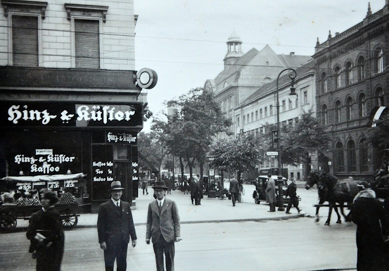
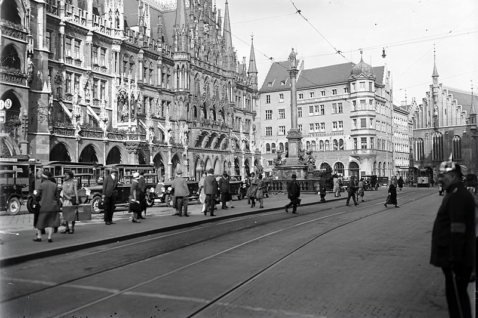
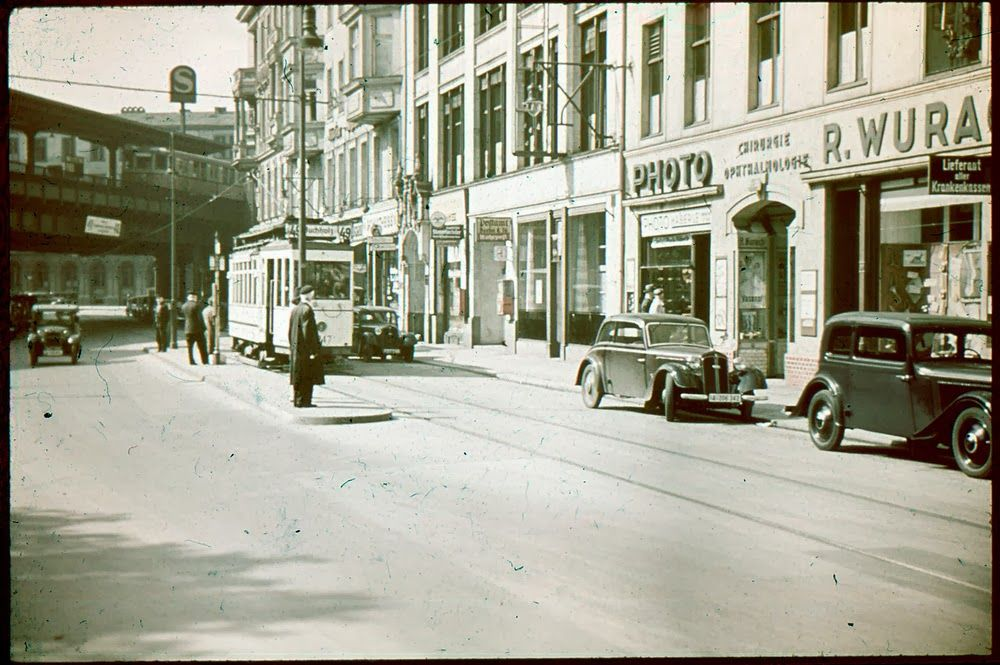

# Рихтер

Я как раз проезжал на своем обветшалом, скрипучем, но вполне еще рабочем велосипеде по Нойштадт-ан-дер-Вайнштрассе, как увидел моего знакомого Рихтера, энергично жестикулирующего мне с другой стороны улицы. В любой другой день я бы просто отсалютовал и отправился дальше по своим неотложным делам. Но не в этот день. Только не в этот день.

Рихтер был чрезвычайно рад, что я не проигнорировал его призыв и примчался к нему, пересекая оживленную улицу. Мы встретились возле арки. Вокруг сновало множество пешеходов. Одни на ходу читали газеты, другие понуро куда-то шагали, уткнувшись в мостовую, но большинство мирно прогуливалось, наслаждаясь мягким осенним солнцем, заливающим проспекты и площади. На лицах этих праздных гуляк я видел смесь тревоги и ликования, а иногда — просто самодовольное экстатическое воодушевление.

Второпях поприветствовав меня, Рихтер быстро, да так, чтобы никто не обратил внимания, прошмыгнул во двор. Я последовал за ним, чувствуя неладное.

— Сбывается, все сбывается, — сказал он шепотом, приблизившись ко мне. При этом он несколько необычно поддерживал свою самую обычную шляпу на голове, натянув ее на брови.

— Что сбывается? — спросил я едва слышно и машинально осмотрелся по сторонам.

Во дворе никого не было, полнейшая тишина. Глубокие окна невозмутимо глядели на нас: в некоторых подозрительно застыли занавески, а из других торчали во двор предательские форточки, пытаясь нас подслушать. В этом кататоническом безмолвии казалось, что наше перешептывание звучит как бормочущее в дальней комнате радио. Мне было бы спокойнее говорить на оживленной улице, по которой мчатся автомобили. Уж такое было время.

— Катастрофа надвигается, Ганс, она неизбежно надвигается, и перед многими из нас встает вопрос «как быть». Я хотел бы тебе столько всего рассказать, но на это нет времени. Одно знаю точно: если ты немедленно покинешь страну, ты не будешь неправ. Впрочем, теперь верить никому нельзя — ни радио, ни газетам, ни своему соседу, ни даже мне! Нужно смотреть, думать и делать выводы. Слова лживы, факты исковерканы, моральные устои перевернуты с ног на голову.

Я не мог дать оценку его психическому состоянию в тот момент, но это был не тот Рихтер, которого я знал. Он был чрезвычайно взволнован; смесь разных чувств переполняла его, и было сложно сказать, тревога это или отчаяние, а может, параноидальный психоз. Но самым обескураживающим был страх, выглядывающий из-под этого всего — неопределенный, похожий на закваску, медленно прогрессирующий страх.

— Ты не мог бы выражаться яснее, Рихтер? Вокруг много всего происходит, и все мы куда-то движемся, но ведь никто толком не знает куда. Зато я вижу ликующий, сплоченный народ, как никогда полный решительности и стойкости. Мы так воодушевлены, так сильны в нашей непоколебимой вере. Разве это не триумф? Триумф воли! Друг мой, мы все будем счастливы, я думаю, нас ждут великие дела.

— О, Ганс, — сказал он мрачно и крепко взял меня за предплечье, — все не так, все не то, чем кажется. А теперь пойдем и выпьем пива, возможно, это последний шанс, перед тем как наши судьбы сделают крутой поворот и разойдутся.

И тут я понял, что, несмотря на эти тревожные, может, даже чрезмерно эмоциональные речи, самым желанным для меня было бы поддаться искушению, бросить велосипед и пойти выпить. Да, я, конечно, понимал, что мы стоим на пороге чего-то необратимого, может, даже страшного, но мир вокруг не казался мне таким хрупким и беспомощным, как ему. Я не мог даже подумать о том, что это случится завтра или на этой неделе. Скоро, но не сейчас. Хотя другая, неумолимая, навязчивая мысль твердила мне, что Рихтер прав, что это происходит прямо сейчас и прямо здесь, что нет времени даже на то, чтобы пить пиво и о чем-то разговаривать. Но рациональный, эгоцентричный и сухой я ответил:

— Боюсь, это невозможно, мои дела не терпят отлагательств. Может быть, в другой раз? Я бы с удовольствием…

— Другого раза не будет!

Он оглянулся по сторонам, вдруг осознав, что перешел на повышенный тон и его возгласы, может быть, слышно с улицы. Рука, вцепившаяся мне в предплечье, обмякла и устранилась. Я только заметил, как длинный бежевый плащ, развиваясь от быстрой поступи, выплывает из-под тени арки и вырывается на улицу, где мгновенно растворяется в суетливой толпе.

Мне стало так грустно, так тяжело на душе от такого нашего расставания и вдвойне тягостно от того, что я понимал, как я осекся, какую ошибку допустил. Я побежал за ним следом, догнал его на перекрестке и все исправил. Да, так все и было — только в моем воображении. На деле же я сел на свой велосипед и отправился в контору.

Погода стояла дрянная: стянутый свинцовым сводом сырой осенний день. Я стоял у ворот, под карнизом, и рассматривал свои сапоги. Они не хуже, чем у других офицеров, но все же не новые. Напротив меня, на площадке, толпились несколько человек в одних только полосатых рубашках и таких же штанах. На ногах каждый имел по новейшей паре сапог. Они еле плелись по специальной дорожке, измотанные, грязные и подавленные. Их силуэты яростно заливало дождем, и я был даже этому рад — не мог долго на них смотреть, а должен был.

Впрочем, несмотря на такую жуткую непогоду, вечер обещал быть интересным. Планировались посиделки у Макса Штайна, а это значило, среди прочего, танцы, песни и шнапс. Вероятно, там будет и Эмма, и если так, то я просто обязан наконец набраться смелости и пригласить ее на свидание.

Тут я услышал рев мотора — приближался грузовик. Штайнер пошел отпирать ворота, а я присматривал, чтобы все шло согласно инструкциям. На территорию въехал автомобиль — привезли пополнение. Незамедлительно появилась вооруженная охрана, и я, уже зная, что будет дальше, закурил, со скуки разглядывая грязь на колесах.

Новоприбывших высадили из кузова и построили во дворе. Они были растерянными и испуганными. Кому-то из них пришлось врезать, обозначив правила и дисциплину. Затем их повели к воротам, и пришла моя очередь делать свою работу. Я методично, как всегда, снял замки и отворил засовы, впуская их за ограждение. Они шли молча, еще не понимая, что их ждет, и разглядывали все вокруг и меня тоже, а может быть, только мой автомат. И тут я увидел его.

Тусклый день, пронизанный холодной моросью, вдруг растаял: все наполнилось мягким солнечным сиянием, какое освещает ранним летним утром тихие улочки моего любимого Гейдельберга, его старые скверы и превосходные канцелярии; ветерок принес свежий запах черемухи и аромат утреннего чая. Передо мной стоял Рихтер. Он весьма похудел и слегка сгорбился, но сомнений быть не могло. Не знаю зачем, но я отвернулся, когда его проводили рядом, а затем вернулся в серый промозглый день, к выполнению своих обязанностей, и довольно быстро позабыл о том, что случилось.

Через пару дней я увидел его снова, когда шагал вдоль бараков, озадаченный приказом коменданта немедленно прибыть к нему в кабинет. Он, в сопровождении надзирателя, раскачиваясь, словно флюгер, дрябло ступал по дорожке, и так случилось, что мы вдруг встретились взглядом. Я тут же приблизился и сказал:

— Здравствуй, Рихтер!

— Здравствуй, — сказал он утомленным голосом. — Вот мы и встретились. Где, как не здесь, нам было суждено встретиться? Осталось уже недолго, так ведь?

Мне было нечего ему возразить, ведь он был совершенно прав.

Я прибыл к коменданту, и он, расхаживая по кабинету в своей обычной манере, проинформировал меня о том, что от командования поступило распоряжение незамедлительно покинуть лагерь, сжечь все документы и избавиться от заключенных.

Меня и Штайнера назначили караулить ворота, откуда мы могли видеть все, что происходило в тот день. Ровно в четыре вечера заключенных вывели на плац перед бараком и выстроили в стенку у самого забора. Они, словно безвольные истощенные куклы, повиновались надзирателям беспрекословно и молча. Вообще, стояла удивительная тишина: никто не говорил ни слова, кроме капитана, который кратко и звонко отдавал приказы. Затем послышались щелчки затворов и серия выстрелов. Мне кажется, я даже видел, как Рихтер упал где-то там, на сырую землю. Потом его, вместе с остальными, свалили в груду безжизненных тел.

Может быть, он был по-своему прав, хотя надо признать, он ничего не добился в своей короткой жизни. Впрочем, и я стал птицей невысокого полета — вместо того чтобы стоять в карауле, я мог бы отдавать приказы, как это делал капитан, громогласно и уверенно. И все же, судя по новостям, правда, вероятно, на стороне Рихарда. Жаль, что я так и не отважился выпить с ним пива в тот прекрасный летний день.

Что же, сегодняшний вечер мы еще в лагере, но вскоре пойдем дальше. Мне разрешили забрать пару бутылок шампанского, которое осталось у нас на складе. И еще нужно обязательно сказать Эмме про мои чувства. Какие же у нее прекрасные руки. Я думаю, она будет рада, если я сочиню для нее пару поэтических строк.

