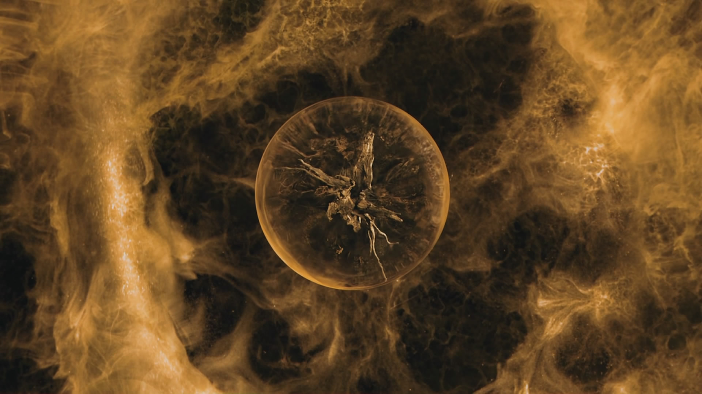

# Шамбала

Шевелящаяся истома заполнила непостижимые глубины моего исковерканного сознания. Я смотрел и не мог поверить, как это возможно, чтобы объект моего наисакральнейшего вожделения явился мне, внезапно возник передо мной, без всяких, с моей стороны, потуг и рвений.

Я бы хотел сделать что-то безукоризненное, что-то ценное, на худой конец священное, но я был так далек от всего этого, что мог только взирать на пышную зелень за моим окном и багряное небо, скованное ползучим мраком. Хотя я сидел в просторной комнате с одной только тлеющей лампой в дальнем углу на столе, а сумерки разливались маслом по стенам и мебели, мое сознание то уносилось прочь к воспетому мною выше мгновению, то возвращалось к своему дому, бездумно плавая в трещинах старого подоконника или скользя по поблескивающей паутине, украшающей небольшую форточку.

Затем я приготовил чай и уселся на веранде. Было уже совсем темно, и блеклая лампочка, привязанная к потолку, манила мотылька, болтающегося подле нее. Я не возражал против гостей. В конце концов, одиночество накладывает свой отпечаток.

Скоро ночь, и мне нужно покинуть дом. Я пойду по тропе, выскобленной в высокой траве, окружающей усадьбу. В каком-то месте деревья сомкнутся, и мне придется пробираться между ними, цепляя колючие ветки. Я буду стремительно шагать по кочкам в гуще лесистых болот, пока не выйду на опушку, посреди которой скорчилось гнилое бунгало. Там я обнаружу скрипучую дверь, войду внутрь, проникну в дальнюю кладовую и подниму скрытую от посторонних глаз крышку люка. В который раз мне предстоит поцарапать руки о ржавые скобы, ведущие ко дну колодца, и там, по разветвленным тоннелям, я дойду до заветной комнаты. Я нащупаю на пыльном столе высокий резной канделябр, зажгу свечи и открою маленькую полукруглую дверцу в светлицу с моею потусторонней мечтой.

Сегодня будет последний день моего чудовищного эксперимента. Я не намерен возвращаться сюда, и моим новым домом станет комната, оборудованная глубоко под землею. У меня достаточно запасов и всего остального, чтобы не выходить на белый свет годами, и если мне понадобится что-то, я всегда смогу выбраться среди ночи из моего нового логова и отправиться в маленький приморский городок. Правда, я не думаю, что это случится, потому как те материи, которые мне предстоит опробовать, едва ли позволят мне вернуться к обыденной жизни замкнутого интеллектуала, ведущего немыслимую для большинства людей борьбу с неумолимыми силами природы.

Да, я подобрал ключ к тому замку, который остается не только недосягаемым для других, но о котором никто даже вообразить не может. Это тайна тайн, это секрет секретов. Миллиарды засовов на миллионах дверей в лабиринте бесконечных коридоров. И я нашел нужную комбинацию! Нет, я не умнее и прочнее многих других, но у меня была миссия, которая вынудила меня смотреть на мир по-другому. Из всего мне досталась только несокрушимая воля. Когда лишаешься всех иллюзий, отказываешься от всего материального и, следовательно, проходящего, пробуждается нечто, что неизбежно приведет тебя к твоей самой неудержимой мечте. Через тернии к звездам! Испытания, выпадающие на долю того, кто неумолимо следует своей воле, кажутся пустяками; преграды только укрепляют силу этого безудержного стремления добраться до намеченной цели.

Мои изыскания не были ни произвольными, ни производными — это был чистый, осознанный процесс: как будто проводишь провода под потолком, подключаешь к генератору электрического тока, и на другом конце загорается лампочка. Единственное, что требовалось, — это доказать, что свет источника непременно рассеет тьму вокруг себя, что операция осуществима. С момента моего полного и всеобъемлющего отчаяния, когда концентрация боли достигла своего апогея, я всецело и безотчетно верил в то, что задуманное сработает. Да, пожалуй, мне не выразиться яснее, но нужно ли?

Мрак сгущался, ветер начал колыхать ветки березы за окном. И я призадумался, окончательно осознав, что я более никогда не увижу все это. Меня захлестнули эмоции: остался последний шаг, неотвратимое уже на пороге, а я все не решаюсь отпустить все, что так дорого мне. Многое теперь озарилось светом непостижимого великолепия, наполнилось смыслом, обрело значимость. Вглядываясь в кромешную темноту за окном, я все же видел обтянутый камышом пруд, и шпиль старой церкви, и глубокую лощину, и каменный мост через ручей. Все это было бесконечно дорого мне. Я давно отверг постулат о смысле существования как стремлении к материальным благам, отринул все, что не имеет истинной ценности и не содержит добродетели. Я был свободен. Но прямо сейчас расставание даже с этою старою березой было для меня в тягость. Конечно же, нет такой привязанности, которая бы остановила меня, но я позволил себе немного потосковать.

Прошло какое-то время, и наконец я покинул усадьбу, с легким мешком на спине и с тяжелым сердцем, переполненным грустью от неизбежного и бесповоротного расставания с моею обителью. Путь мне освещает наполненная светом луна. Она провожает меня сегодня, как в тот день, когда я впервые шагнул в потусторонний мир.